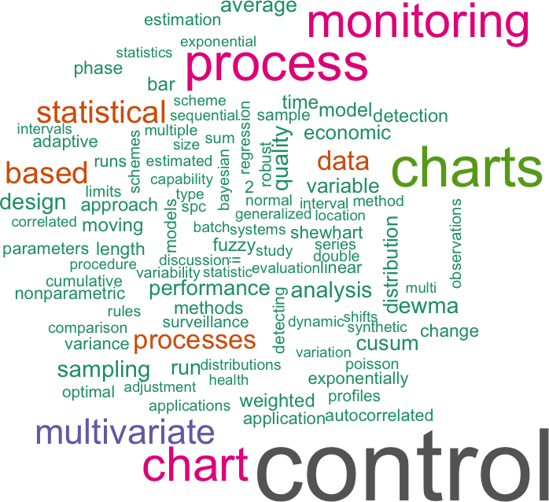
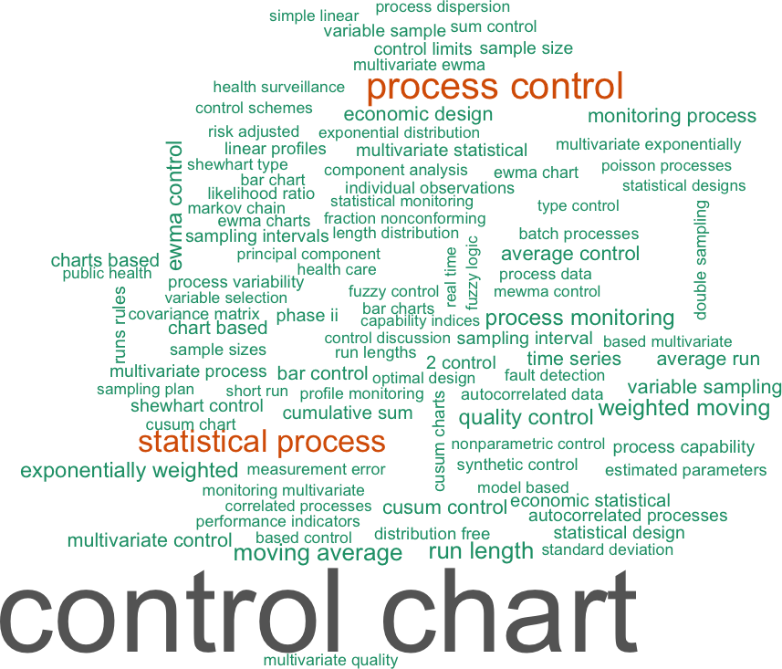
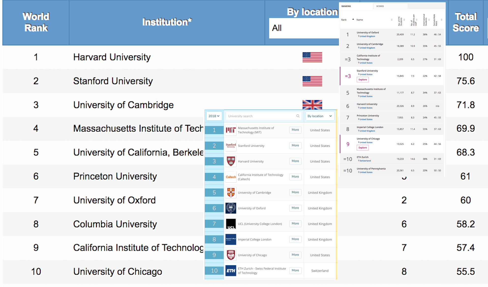

layout: true
class: left, top
background-image: url(../assets/logos/CEBRALogo-01.svg)
background-size: 215px
background-position: right top

---
class: left, top

# Thanks to:

- Edith Arndt
- Karen Schneider
- Andrew Robinson

---
class: inverse, center, middle
background-image: url(img/detector-dog.jpg)
background-size: 60%
background-position: middle center

# In the beginning&hellip;

```{r,knitr-setup,echo=FALSE,warning=FALSE,message=FALSE,cache=FALSE,results="hide"}
library(dplyr)
knitr::opts_chunk$set(cache = FALSE, error = FALSE, warning = FALSE,
                      message = FALSE, echo = TRUE)
options(digits = 2)

```

???

- the centre of excellence for biosecurity risk analysis supports Aus Gov DAWR and NZ MPI by performing research into biosecurity issues
- what is biosecurity?
  - in general, the combined efforts to protect human health, social amenity, and maintain unique, biodiverse natural environments
  - it is built on shared responsibility between all levels of government, industry bodies, exporters/importers etc.
- and what is biosecurity risk?
  - the likelihood of a disease or pest:
    - entering Australian territory or a part of Australian territory; or establishing itself or spreading in Australian territory or a part of Australian territory; and
  - the potential for any of the following:
    - the disease or pest to cause harm to human, animal or plant health; the disease or pest to cause harm to the environment; economic consequences associated with the entry, establishment or spread of the disease or pest.

---
class:left, top, slide-number-off
background-image: url(img/flow-diag-trans.png)
background-size: 90%
background-position: left bottom

# Inspection Process

.logo-overlay[]

???

Detail how a 'unit' interacts with the department through the inspection tree.

- let's now consider how 'units' (which may be passengers, goods, pets, cars etc) interact with the department, assume that there's a total volume V arriving
- when a unit arrives at the border, there are many different types of interactions: checking of documents, canine inspection (like what we just saw), xray, manual, etc
  - let's just call all of these an 'inspection'
- sometimes, a unit is not inspected
  - this is due to a number of factors, e.g. the risk of the good (some goods have risk-based inspection, which means they only get inspected a certain frequency of the time)
  - there are far too many units coming in to inspect them all - imagine having to inspect everyone that's just got off an A380 at Melbourne airport, and repeating that for the XXX passengers per year
- so we send the unit to the left or the right, depending.
- some units undergo an endpoint survey: inspection of units that have already cleared the border
  - this what allows us to estimate the 'dirtiness'
  - important because it is randomly chosen. those that are selected for inspection initially are generally profiled, thus biased
  - furthermore, we assume the initial inspection is not always perfect: there is some 'dirtiness' leaked
- so we can estimate an important quantity, the approaching compliance rate, i.e. the proportion of units that are compliant with Australia's biosecurity regs before intervention
  - C = C_{I} x C_{1} / N_{1} + V_{NI} x C_{2} / N_{2}
  - AC = C / V

---
class: inverse, center, middle

# How do we monitor performance, and identify when particular *pathways* may be under-performing, or when intervention is required?

???

- this is the aim

---
class: left, top
background-image: url(img/perf_mod.gif)
background-size: 90%
background-position: left bottom

# Performance

.logo-overlay[]

???

- from the approaching compliance, we can calculate a whole suite of important indicators
  - some of these include the effectiveness of our inspections, and the compliance rate after inspection
- and because we are doing this over time, we end up with a series of indicators that look something like what is shown in the graphic
- assume that each of these lines shows how one particular performance indicator behaves over time
  - and that each of these is *nested within* a certain level of a hierarchy
  - in our motivating example, this could be where the unit was inspected, or how the units was inspected (e.g. xray)
  - but this could also be hospital within state within Aus, or school within region within state, etc.
- what we would like to be able to do, is to say (for example) whether one unit's 'experience' is different from the last period, or from some benchmark
  - what commonly happens is that we compare one unit to another (or to the *average* unit)

---
class: center, middle

.pull-left[

]

.pull-right[

]

???

- These figures were created by searching web of science for topics/titles containing performance indicators, process charts, league tables etc
  - within the 'statistics and probability' classification
- 'control' stuff far outweighs others
  - not surprising given its long history in industrial statistics
- process control, league tables etc are all related
  - they deal with performance, and performance indicators

---
class: middle, left

.pull-left[


.footnote[
[via GIPHY](https://giphy.com/gifs/movie-food-fwfbJvRNHb5sI)
]

]

.pull-right[

<!--  -->


.footnote[
[Times Higher Education](https://www.timeshighereducation.com/world-university-rankings/2018/world-ranking#!/page/0/length/25/sort_by/rank/sort_order/asc/cols/stats), [QS Top Universities](https://www.topuniversities.com/university-rankings/world-university-rankings/2018), [Shanghai Ranking](http://www.shanghairanking.com/ARWU2018.html)
]

]

???

- 'process control' focuses on detecting when a process moves away from an 'in-control' situation, whilst league tables (as seen in medicine and education) focus on comparing institutional performance
  - again we're still talking about indicators and performance
- the process control literature is really about what's happening over time, whereas the focus (at least what I've seen and traditionally) on performance in medicine and education (let's say) has been much more about point-in-time comparisons between different institutions
- from a consumer's point of view (to take the example of ranking hospitals), we're not generally able to choose the hospital we want, e.g. due to distance, or emergency priority
  - so ranking/comparing institutions here does little for the consumer
  - it does little for the manager as well, as there is often little indication of the level of performance, what is acceptable, and whether performance is improving or deteriorating
  - should we/they focus on where we are in the league chart, or whether we're improving?

---
class: bottom, right
background-image: url(img/myschool.png)
background-size: cover

[My School](https://www.myschool.edu.au/)

???

- what I think we'd really like, and at least what is more useful for those managing processes at an individual level, is to look at the whole process, i.e. the evolution over time
- I include this snapshot from myschool as I think it explains things really well in terms of what's happening for the individual school
- however, whilst it may be appropriate to 'measure' against an average, (alert: opinion!), I think it'd be better to measure against a standard
  - the standard could be the minimum goal, for example. of course, this requires thought be managers/leaders, which can be difficult...
- furthermore, are we really measuring against the 'average' school in this case?
  - the 'average' school will also have an error in its performance
  - in 2017, we're going to be pretty similar, but in 2016, how much different?
- so what can we do? of course we can model the processes that are taking place, and of course, that's what's starting to happen. Bronskill 2002, Longitudinal profiles of health care providers, do just that, but comparisons are still made with the 'average', furthermore, the comparisons are made by referring to a test statistic based on Mahalanobis distance of regression coefficients---something that will be difficult for a large number of people to understand
  - furthermore, the test statistic, in all its transformed glory, is so far divorced from the process being monitored, interpretation is nigh on impossible
  - in fact, they end up selecting institutions to monitor by referring to tail probabilities. this results in a fixed number of 'interesting' units, again divorced from the actual context in which the monitoring is taking place
- this, in fact, mimics the setting of the statistical process control literature
  - maybe its just that I haven't spent enough time considering it, but it reads as arcane to me. a huge amount of really technical jargon flying around, obscurity in decisions etc.

---
background-image: url(img/ani_mod.gif)
background-size: cover

# .right[<span style="color:rgb(249, 38, 114);">Regression to the Mean</span>]

???

- related to accounting for the recent history, is the issue of regression to the mean
  - that is, that an extreme value in one period, is more likely to be less extreme in the next period
- this has come up a couple of times in the med lit, notably Burgess et al., Jones and Spiegelhalter, and Kasza et al.
  - the Burgess paper is really quite good in its ideas, its unfortunate that many others following haven't really taken on many of those themes. the modelling approach I think is really powerful.
  - both these approaches employ a test statistic for unusual observations, using nhst for 'surprise' (and FDR corrections)
- the kasza approach extends the jones/spieg approach to multiple periods, but is nonetheless still focused on an NHST approach
- (opinion!) I think we should be focusing on probabilities of events occurring (e.g. drops etc.) or minimum standards being met
- the other awesome feature of the Burgess paper is its focus on probability statements and interval standards
  - that is, comparing an institution (to itself, or between others) should be done via via probabilities, e.g. the probability that a standardised mortality ratio lies between x and y, or totally below a maximum threshold

---
class: middle, left

# Aggregation

.pull-left[

]

.pull-right[

\begin{align}
\theta_{s} & = \frac{\sum_{j \in s} n_{j} I_{j}}{\sum_{j \in s} n_{j}}
\end{align}

Here $I{_j}$ is the value of the indicator in the hierarchy level $j$, and $n_{j}$ is the population count.

]

???

- so it's at this stage that we've discussed most of the building blocks of a good performance monitoring scheme:
  - flexibility, which comes from the modelling aspect
  - the ability to deal with the temporal aspect and small sample sizes/regression to the mean
  - it's important to note at this point, that by modelling the indicators, we can also 'fill in'/impute/predict when there are no direct observations in a period. in our motivating study, it's likely due to efficiencies/timing etc, that no inspections will be performed in certain pathways (but there's still activity, and hence leakage, on that pathway)
- I want to throw one more block onto the pile here: aggregation
  - there's natural hierarchies (which we're exploiting) and (especially under our scenario) we may (will) be interested in how these indicators are tracking at higher levels of the hierarchy
  - the natural approach here then, is to take the weighted sum of the modelled indicators (i.e. post-stratification) as the aggregated value
  - if (as we do in our application) you take a Bayesian approach to the modelling, the distribution of the aggregated weights of course falls out nicely, which then means we can make probability statements about the aggregated indicator

---
class: top, left

# Putting it Together

.pull-left[

Our framework will combine and include:

- statistical modelling;
- hierarchical/temporal indicators;
- flexibly defined performance measures;
- aggregation to desired levels;
- interval representations; and
- be probability-based.

]

.pull-right[


.footnote[
[via GIPHY](https://giphy.com/gifs/season-3-the-simpsons-3x11-3o6Mbr1blVD5KKQBxK)
]

]

???

- the framework will involve everything listed here
- (appropriate) statistical modelling of hierarchical/temporal indicators will allow us to end up in our desired state of having a probability-based measure
  - there will be many situations where we have no inspections, so we can account for this sparsity with a model
  - aggregation via post-stratification easy with the model
- probability-based means that we can calculate a probability for any event/quantity of interest
  - this (I think) is really important for including the process that managers will be interested in. we can frame indicators directly in their language, for example, probabilities of an increase over a certain amount between two time periods

---
class: top, left

# Example Decisions

<table>
<tbody>
<tr class="odd">
<td style="text-align: center;"></td>
<td style="text-align: left;"></td>
<td style="text-align: center;" colspan="3">Probability (<span class="math inline"><em>p</em><sub><em>b</em></sub></span>) that the indicator is less than the benchmark</td>
</tr>
<tr class="even">
<td style="text-align: center;"></td>
<td style="text-align: left;"></td>
<td style="text-align: left;"><span class="math inline"><em>p</em><sub><em>b</em></sub> &gt; <em>P</em><sub>1</sub></span></td>
<td style="text-align: left;"><span class="math inline"><em>P</em><sub>2</sub> ≤ <em>p</em><sub><em>b</em></sub> &lt; <em>P</em><sub>1</sub></span></td>
<td style="text-align: left;"><span class="math inline"><em>p</em><sub><em>b</em></sub> &lt; <em>P</em><sub>2</sub></span></td>
</tr>
<tr class="odd">
<td style="text-align: center;" rowspan="3">Probability (<span class="math inline"><em>p</em><sub><em>i</em></sub></span>) that the indicator is decreasing</td>
<td style="text-align: left;"><span class="math inline"><em>p</em><sub><em>i</em></sub> &gt; <em>P</em><sub>1</sub></span></td>
<td style="text-align: left; color: #F2F2F2; background: red;">Take Action</td>
<td style="text-align: left; color: #F2F2F2; background: orange;">Pay Attention</td>
<td style="text-align: left; color: #F2F2F2; background: green;">Acceptable</td>
</tr>
<tr class="even">
<td style="text-align: left;white-space: nowrap;"><span class="math inline"><em>P</em><sub>2</sub> ≤ <em>p</em><sub><em>i</em></sub> &lt; <em>P</em><sub>1</sub></span></td>
<td style="text-align: left; color: #F2F2F2; background: red;">Take Action</td>
<td style="text-align: left; color: #F2F2F2; background: orange;">Pay Attention</td>
<td style="text-align: left; color: #F2F2F2; background: green;">Acceptable</td>
</tr>
<tr class="odd">
<td style="text-align: left;"><span class="math inline"><em>p</em><sub><em>i</em></sub> &lt; <em>P</em><sub>2</sub></span></td>
<td style="text-align: left; color: #F2F2F2; background: orange;">Pay Attention</td>
<td style="text-align: left; color: #F2F2F2; background: green;">Acceptable</td>
<td style="text-align: left; color: #F2F2F2; background: green;">Acceptable</td>
</tr>
</tbody>
</table>

???

- suppose we have an indicator for which a decrease is not desirable
- from our statistical model, we could calculate the probability of a decrease (and even the probability of a decrease of more than x%), or the probability that the indicator is less than the benchmark we set
  - this is easy to do when we have sims from our model, such as from some form of MC
- this next point is the most important!
- clearly this requires strong involvement of managers looking after the processes, but I think that too often we see that performance monitoring occurs relative to some baseline average, or against the 'average' unit/institution without recourse to the actual process at hand
  - who really cares if the unit is below the 'average' unit, if its performance is both increasing, and better than the desired benchmark?
  - if all units are better than the benchmark, then possibly the benchmark needs adjusting, but that will of course depend upon the context.

---
class: top, center

# Recapping

A great framework for monitoring performance in a structured system will take into account: the temporality of the system; the (nearly always present) hierarchies; any sparsity issues; and be amenable to aggregating the various levels.

Moreover, a great monitoring framework will *involve* key decision makers to derive appropriate probability bounds for key events of interest.

---
class: center, middle

# Thanks

---
class:top, left, references

# References

Burgess, J. F., Jr, Christiansen, C. L., Michalak, S. E., & Morris, C. N. (2000). Medical profiling: improving standards and risk adjustments using hierarchical models. Journal of Health Economics, 19(3), 291–309. <https://doi.org/10.1016/S0167-6296(99)00034-X>

Bronskill, S. E., Normand, S.-L. T., Landrum, M. B., & Rosenheck, R. A. (2002). Longitudinal profiles of health care providers. Statistics in Medicine, 21(8), 1067–1088. <https://doi.org/10.1002/sim.1060>

Jones, H. E., & Spiegelhalter, D. J. (2009). Accounting for regression-to-the-mean in tests for recent changes in institutional performance: Analysis and power. Statistics in Medicine, 28(12), 1645–1667. <https://doi.org/10.1002/sim.3583>

Kasza, J., Moran, J. L., & Solomon, P. J. (2015). Assessing changes over time in healthcare provider performance: Addressing regression to the mean over multiple time points. Biometrical Journal. Biometrische Zeitschrift, 57(2), 271–285. https://doi.org/10.1002/bimj.201400105
