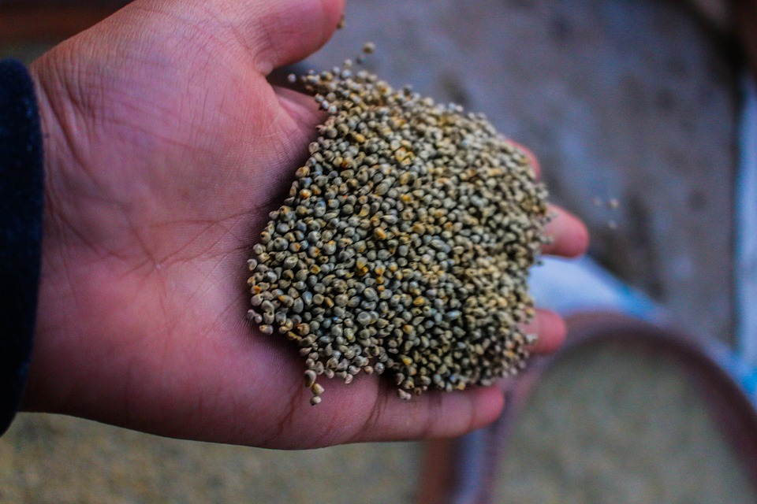
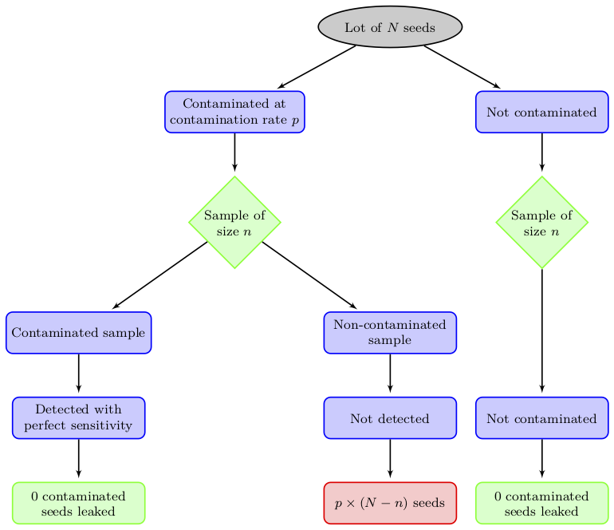

<!-- Time-stamp: <2018-05-30 15:06:44 (slane)> -->

```{r setup,echo=FALSE,warning=FALSE,message=FALSE,cache=FALSE,results="hide"}
library(dplyr)
knitr::opts_chunk$set(cache = FALSE, error = FALSE, warning = FALSE,
                      message = FALSE, echo = TRUE, out.width = "622px",
                      out.height = "350px", dpi = 180, fig.align = "center",
                      popup = TRUE, fig.asp = 9/16)
options(digits = 2)

```

background-image: url(img/redpill-bluepill.jpeg)
background-size: cover

---
class: inverse, center, middle
background-image: 

# Sampling From Multiple Lines

---
layout: true
class: left, top
background-image: url(../assets/logos/CEBRALogo-01.svg)
background-size: 215px
background-position: right top

---

# ISPM 31

A lot to be sampled should be a number of units of a single commodity identifiable by its homogeneity in factors such as:

.pull-left[
- origin
- grower
- packing facility
- species, variety, or degree of maturity
- exporter
]

.pull-right[
- area of production
- regulated pests and their characteristics
- treatment at origin
- type of processing.
]

---

# Heterogeneous Consignments

.pull-left[

<!-- var rugosa -->
]

.pull-right[

<!-- var indurata -->

.footnote[

.right[

<a rel="license" href="https://creativecommons.org/licenses/by-sa/2.0/"></a> [Sam Fentress](https://commons.wikimedia.org/wiki/File:Corncobs.jpg)

]

]

]

---

# The Regulator

Suppose the regulator is happy to apply a compliance rule across an entire consignment. Then:

- the *consignment* is compliant if the sample (across multiple lines) returns no contaminated items
- if contaminated items are found, the *whole* consignment is rejected

---
class: center, middle

# The Problem

.bigr[
How then, do we sample from each line, without making assumptions about individual line prevalences?
]

--

# The Solution

.bigr[
<span style="color:#f92672">By sampling proportional to the line volumes.</span>
]

---

# The Setup

Assume there are $K$ lines, with $N_{k}$ units in the $k$<sup>th</sup> line making a total of $N = \sum_{k} N_{k}$ units. If the contamination rate in line $k$ is $p_{k}$ then the joint contamination rate, $p$, satisfies $\sum_{k} N_{k} p_{k} = N \cdot p$.

Fix the total number of units sampled $n$, and choose some fixed weights $w_{k}$ such that $\sum_k w_{k} = 1$ and $n_{k} = n w_{k}$.

The sensitivity of inspection is
$$
\begin{align}
  S = 1 - \prod_{k=1}^{K} (1 - p_{k}) ^ {n_{k}}
\end{align}
$$

---

# The Line Prevalences

With our sample size $n$ and weights $w_{k}$ fixed, we can find the line prevalences that will minimise the sensitivity as
$$
\begin{align}
  1 -  p_{k} = (1 - p) w_{k} \frac{N}{N_{k}}
\end{align}
$$

--

> Note: this is true for any set of fixed weights, and should alert you to what form the $w_{k}$ should take!

Thus, if we take our weights as proportional to the line volumes, sensitivity is *minimised* when all line prevalences are equal to the joint contamination rate $p$.

---

# The Sample

Recall the sensitivity:
$$
\begin{align}
  S = 1 - \prod_{k=1}^{K} (1 - p_{k}) ^ {n_{k}}
\end{align}
$$

Substituting $p_{k} = p$, gives the familiar sample size formula:
$$
\begin{align}
  n = \log(1 - S) / \log(1 - p)
\end{align}
$$

Which we divvy up by sampling (at random) $n_{k} = n\frac{N_{k}}{N}$ units from line $k$.

---
class: center, middle

# Imperfect Detection

.bigr[
What about it?
]

---
class: center, middle

# No Worries


---
class: inverse, center, middle
background-image: 

# Sample Size Calculations for Phytosanitary Testing of Small Lots of Seed

---

# The Problem


Minimal infected material is required to transmit viruses and diseases, so we want to be *really* sure we detect contamination if present.

- Common design parameters:
  - $p=0.1\%$
  - $S=0.95$

<hr>

--

.bigr[
Requires a sample size of approximately <span style="color:#f92672">3000</span>!
]

(from our previous discussion on sensitivity)

---

# The Problem

.pull-left[

]

.pull-right[


.footnote[

.right[

[StockCargo](http://www.stockcargo.eu/)

]

]

]

---

# Focussing on the Line

What if there's only 1500 seeds in the consignment?

--

We commonly appeal to the Hypergeometric distribution, $X \sim \text{Hypergeometric}(x, m, N, n)$.

$$
\begin{align}
\Pr(X = x) & = \frac{{m \choose x} {{N-m} \choose {n-x}}}{{N \choose n}} \text{, for } x \in 0, 1, \ldots, \min\{m, n\}
\end{align}
$$

Where $X$ is the number of contaminated seeds present in a sample of size $n$, that is drawn from a lot of size $N$ containing $m$ contaminated seeds.

---

# Example

With design parameters and lot size:

- $p=0.1\%$
- $S=0.95$
- $N=1500$

we would *expect* there to be 1.5 contaminated seeds in the lot. .bigr[`r emo::ji("thinking")`]

<hr>

--

It's common to *round down* so that we assume in fact we have 1 contaminated seed. This obviously changes our design prevalence; it is now `r formatC(1 / 1500 * 100, format = "f", digits = 2)`%.

---

# Non-monotone Behaviour of the Sample Size

```{r non-monotone,echo=FALSE}
library(ggplot2)
nHyper <- function(prev, N, C){
    m <- max(1, floor(prev*N))
    k <- ceiling((1 - (1 - C)^(1/m)) * (N - (m - 1)/2))
    k
}
N <- 1999:6000
p <- 0.001
n <- sapply(N, function(x) nHyper(p, x, 0.95))
stepN <- function(n){
    curN <- n[1]
    limN <- curN
    for(i in seq_along(n)[-1]){
        if(n[i] >= curN){
            curN <- n[i]
        }
        limN <- c(limN, curN)
    }
    limN
}
out <- stepN(n)
## plot(N, n, type = "l", bty = "l")
## lines(N, out, col = "purple")

## Find points at which an integer number of contaminated seed are found
frac <- MASS:::.rat(p)$rat
N2 <- N * frac[, 1]
mInt <- N[which((N2 %% frac[, 2]) == 0)] - 1
nInt <- sapply(mInt, function(x) nHyper(p, x, 0.95))
yInt <- xInt <- NULL
for(i in seq_along(mInt)[-1]){
    xout <- seq(mInt[(i - 1)], mInt[i], by = 1)
    yout <- approx(mInt[(i - 1):i] - 1, nInt[(i - 1):i], xout = xout)
    yInt <- c(yInt, yout$y)
    xInt <- c(xInt, xout)
}
## lines(xInt, yInt, col = "green")
comp <- tibble(N = c(N, N, xInt), n = c(n, out, yInt),
               Method = factor(c(rep("Unadjusted", length(out)),
                                 rep("Step", length(out)),
                                 rep("Interpolation", length(yInt))),
                               levels = c("Unadjusted", "Step",
                                          "Interpolation")))
plComp <- ggplot(comp, aes(x = N, y = n, colour = Method)) +
    geom_line() +
    theme_bw()
print(plComp)

```

---
class: center, middle

# Are My Design Parameters Arbitrary... ?


What if we choose a sample size to minimise some measure of risk?

---

# Leakage

.center[
</img>
]

---
class: top, left

# Colophon

<i class="fa fa-twitter fa-2x" aria-hidden="true"></i>.bigr[[@mytwitter](https://twitter.com/)]

<i class="fa fa-github fa-2x" aria-hidden="true"></i>.bigr[[mygithub](https://github.com)]

<i class="fa fa-user fa-2x" aria-hidden="true"></i>.bigr[[https://www.example.com/](https://www.example.com/)]

</br>

.footnote[
All views presented within are the author's only, and do not necessarily represent the views of the author.
]
